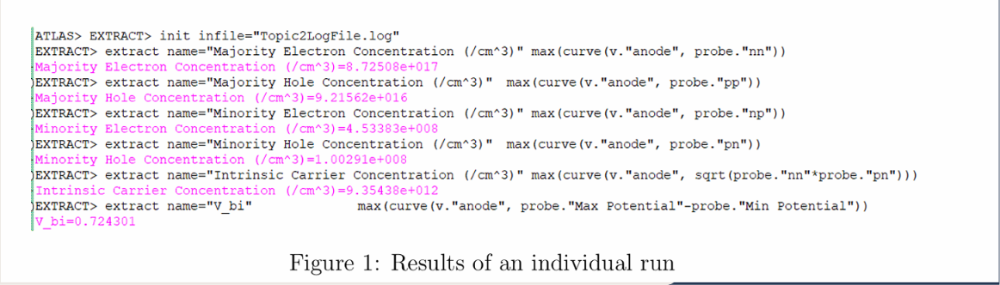
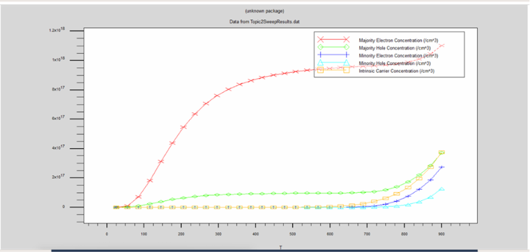
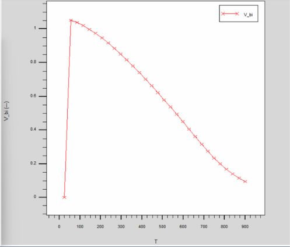

# 🔬 Temperature Dependence of Carrier Concentrations & Built-In Potential in a Silicon PN Junction

<div align="center">


**An abrupt silicon p-n junction swept from 25 K to 900 K in Silvaco ATLAS, benchmarked against analytical carrier statistics to reveal where textbook semiconductor theory breaks down.**

</div>

---

## 📸 Results Gallery

### ATLAS Baseline Extraction (T = 400 K)


### Carrier Concentrations vs Temperature (25 K – 900 K sweep)


### Built-In Potential vs Temperature


---

## TL;DR

Simulated an abrupt Si p-n junction (N_d = 10^18 cm^-3, N_a = 10^17 cm^-3) across **25 K → 900 K** to track how carrier populations and built-in potential move through the freeze-out, partial ionization, extrinsic, and intrinsic regimes — then benchmarked simplified analytical (textbook) carrier statistics against Silvaco ATLAS TCAD to evaluate where the simplified model breaks down.

**Headline finding:** at elevated temperatures, ATLAS predicts a *higher* intrinsic carrier concentration than the textbook model. The gap is explained by physics the analytical model omits — temperature-dependent effective mass and Klaassen bandgap narrowing (BGN.KLAASSEN). More strikingly, V_bi is **not** monotonic: it rises sharply from freeze-out as dopants ionize, peaks around T ≈ 75–100 K, then falls steadily as the junction transitions toward intrinsic behavior at high T.

---

## Baseline Run (T = 400 K)

| Quantity | Value |
|---|---|
| Majority electron concentration, n_n | 8.72508×10^17 cm^-3 |
| Majority hole concentration, p_p | 9.21562×10^16 cm^-3 |
| Minority electron concentration, n_p | 4.53383×10^8 cm^-3 |
| Minority hole concentration, p_n | 1.00291×10^8 cm^-3 |
| Intrinsic carrier concentration, n_i | 9.35438×10^12 cm^-3 |
| Built-in potential, V_bi | 0.724301 V |

At 400 K the junction is solidly in the **extrinsic regime**: n_n and p_p sit close to the nominal doping levels (10^18 / 10^17 cm^-3), while the minority populations are still many orders of magnitude smaller — as expected from mass-action law, n_p·p_n ≈ n_i².

---

## Temperature Sweep Analysis

- **25–150 K (freeze-out → partial ionization):** dopants are not fully ionized, so majority carrier concentration climbs steeply rather than sitting flat at N_d.
- **150–600 K (extrinsic region):** majority electron concentration plateaus near 8–9×10^17 cm^-3 ≈ N_d, confirming near-complete ionization; majority hole concentration is correspondingly lower and flatter, consistent with the 10× lower N_a.
- **> 600 K (onset of intrinsic regime):** minority carrier and intrinsic concentrations rise sharply and start to catch up with the majority levels — the junction is losing its doped identity.

**Built-in potential:**
- **V_bi = 0** at the lowest sweep point (25 K): with dopants frozen out, there aren't enough free carriers on either side to establish a potential barrier.
- **V_bi rises sharply to a peak (~1.05 V) around T ≈ 75–100 K:** as dopants ionize, free-carrier concentrations climb faster than the thermal voltage kT/q grows, so the barrier increases.
- **V_bi then decreases steadily up to 900 K**, dropping toward ~0.1 V: once carriers are fully ionized, the exponential growth of n_i dominates the ln(N_d·N_a/n_i²) term, pulling V_bi down.

This non-monotonic shape is the clearest single result of the project: **V_bi does not simply decrease with temperature** as small-T-range textbook intuition often implies — it's bounded on both sides by the freeze-out limit (no barrier without ionized dopants) and the intrinsic limit (no barrier once the material behaves intrinsically).

At sufficiently high temperature, intrinsic carrier generation dominates and the doped junction gradually loses its extrinsic (designed) behavior — this is the failure mode engineers design against in high-temperature power electronics and wide-bandgap (GaN) devices, which is what makes the analytical-vs-TCAD gap practically relevant, not just academic.

---

## Method

1. Built an abrupt Si p-n junction in Silvaco ATLAS with fixed N_d/N_a.
2. Ran a baseline simulation at 400 K, then swept 25 K – 900 K.
3. Extracted n_n, p_p, n_p, p_n, n_i, and V_bi at each point using ATLAS `EXTRACT` (see `Topic2LogFile.log`, `Topic2SweepResults.dat`).
4. Computed the same quantities analytically using standard carrier-statistics equations (Neamen; Sze & Ng).
5. Compared the two models and attributed the divergence to ATLAS's advanced physical models (temperature-dependent effective mass, Klaassen BGN).

## Simulation Parameters

| Parameter | Value |
|---|---|
| Donor concentration (N_d) | 1×10^18 cm^-3 |
| Acceptor concentration (N_a) | 1×10^17 cm^-3 |
| Baseline simulation | 400 K |
| Temperature sweep | 25 K – 900 K |
| Device structure | Abrupt silicon p-n junction |

## 📁 Project Structure

```
Temperature-Dependence-PN-Junction/
│
├── README.md
├── Report.pdf                              # Full technical write-up with derivations
├── Simulation_Results/
│   ├── Topic2LogFile.log                   # ATLAS baseline extraction log
│   └── Topic2SweepResults.dat              # Full temperature sweep data
└── *.png                                   # Result screenshots (this README)
```

## Skills & Topics

Semiconductor device physics · carrier statistics · p-n junction electrostatics · doping & thermal ionization · Silvaco ATLAS TCAD · analytical vs. numerical modeling · technical documentation.

This project builds directly toward more advanced work in TCAD-based device modeling, reliability analysis, and wide-bandgap (GaN) power device design.

## References

Neamen, *Semiconductor Physics and Devices* · Sze & Ng, *Physics of Semiconductor Devices* · Silvaco ATLAS User Documentation · NANENG 205 Course Materials

---

## 👥 Attribution

Collaborative undergraduate team project — **NANENG 205, Zewail City of Science and Technology**.
This repository is an individually maintained portfolio record of the methodology and results, not a claim of sole authorship of the original team submission.

## 📄 License

No license — educational use only.
